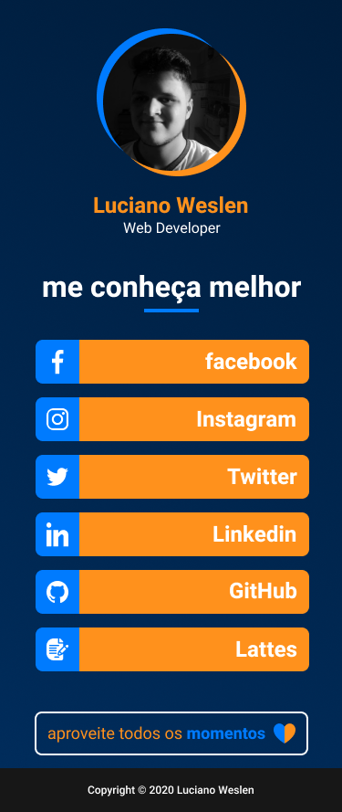

  

 

  
   
  

 

## 📓 Resumo
- [Sobre o projeto](#sobre-o-projeto)
- [Overview](#overview)
- [Design](#design)
- [Tecnologias](#tecnologias)
- [Feito por](#feito-por)
- [License](#license)

## ❓ Sobre o projeto
**Nexus** é um projeto que visa a construção de uma página personalizada com links importantes do usuário como do Facebook, Instagram, Github, etc. Assim o usuário pode colocar um único link para as outras pessoas terem acesso as suas redes sociais com um design totalmente personalizado. 

## 🚀 Overview

  

## 🎨 Design
O **design** da página foi feito utilizando a ferramenta **Figma**, pode ser acessado o projeto através do link abaixo.
 
 

## ⏳ Tecnologias
Para este projeto foi utilizado de **HTML** e **CSS**.

- 
- 

## 👨‍💻 Feito por
<table>
  <tr>
    <td align="center"> <b><a href="https://lucianoweslen.dev/nexus" title="Luciano">Luciano W. da Silva</a></b> Desenvolvedor Web</td>
  </tr>
</table>

## 📜 License
O projeto está sobre a licença [MIT](./LICENSE)

 

